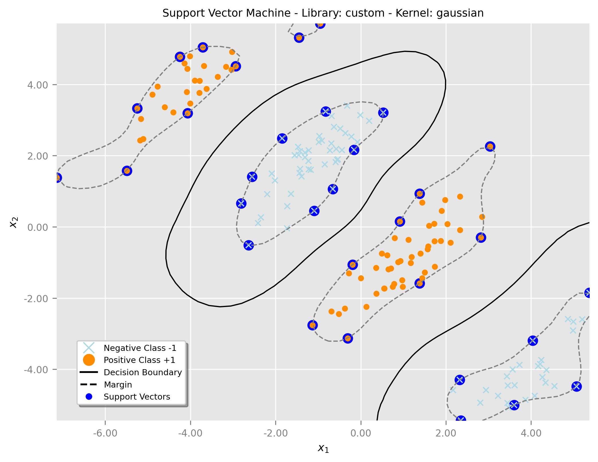

# 支持向量机（SVM）实验报告

## 1.1 背景

支持向量机（Support Vector Machine, SVM）是一种经典的监督学习算法，广泛应用于分类和回归任务，尤其在高维数据分类中表现出色。SVM通过寻找一个最优超平面，将不同类别的数据点分开，最大化类别之间的间隔。这种最大间隔的特性使得SVM具有良好的泛化能力。通过核函数的引入，SVM能够处理非线性分类问题，将数据映射到高维空间实现线性可分。

本实验实现了自定义SVM算法，深入理解其核心原理，并通过实验验证其性能。实验涵盖了线性核、多项式核和高斯核三种核函数，以及硬间隔和软间隔两种分类方式。

## 1.2 原理

### 1.2.1 核心思想

SVM的核心思想是找到一个超平面，使得最近的数据点（支持向量）到超平面的距离（间隔）最大化。其关键概念包括：

- **最大间隔**：SVM寻找一个超平面，使得支持向量到超平面的距离最大化
- **支持向量**：位于间隔边界或误分类的数据点，决定了超平面的位置
- **核函数**：通过核函数将数据映射到高维空间，解决非线性问题
- **软间隔**：通过惩罚参数C，允许部分误分类以提高模型泛化能力

### 1.2.2 数学形式

SVM的优化问题基于以下数学形式：

**硬间隔优化问题**：
$$\min_{w,b} \frac{1}{2}||w||^2$$
$$s.t. \quad y_i(w \cdot x_i + b) \geq 1, \quad \forall i$$

**软间隔优化问题**：
$$\min_{w,b,\xi} \frac{1}{2}||w||^2 + C\sum_{i=1}^n \xi_i$$
$$s.t. \quad y_i(w \cdot x_i + b) \geq 1 - \xi_i, \quad \xi_i \geq 0, \quad \forall i$$

**拉格朗日对偶形式**：
$$\max_{\alpha} \sum_{i=1}^n \alpha_i - \frac{1}{2}\sum_{i,j=1}^n \alpha_i \alpha_j y_i y_j K(x_i, x_j)$$
$$s.t. \quad \sum_{i=1}^n \alpha_i y_i = 0, \quad 0 \leq \alpha_i \leq C$$

### 1.2.3 核函数

**线性核**：
$$K(x_i, x_j) = x_i \cdot x_j$$

**多项式核**：
$$K(x_i, x_j) = (x_i \cdot x_j + 1)^d$$

**高斯核（RBF）**：
$$K(x_i, x_j) = \exp(-\gamma ||x_i - x_j||^2)$$

## 1.3 实验实现

### 1.3.1 核心类设计

实验实现了以下核心类：

1. **Data类**：负责数据生成和处理
   - `generate_linearly_separable_data()`：生成线性可分数据
   - `generate_non_linearly_separable_data()`：生成非线性可分数据
   - `generate_linearly_separable_overlap_data()`：生成有重叠的线性可分数据
   - `split_data()`：划分训练集和测试集

2. **SVM类**：实现自定义SVM算法
   - `__init__()`：初始化模型参数
   - `_kernel_function()`：实现三种核函数
   - `fit()`：训练模型，求解拉格朗日乘子
   - `project()`：计算决策函数值
   - `predict()`：预测类别标签

3. **Plotting类**：负责结果可视化
   - `plot_margin()`：绘制决策边界和支持向量

### 1.3.2 关键算法实现

**核函数计算**：
```python
def _kernel_function(self, x1, x2):
    if self.kernel == 'linear':
        return np.dot(x1, x2)
    elif self.kernel == 'polynomial':
        return (np.dot(x1, x2) + 1) ** self.degree
    elif self.kernel == 'gaussian':
        diff = x1 - x2
        return np.exp(-self.gamma * np.dot(diff, diff))
```

**二次规划求解**：
使用CVXOPT库求解拉格朗日对偶问题，提取支持向量和拉格朗日乘子。

**决策函数计算**：
对于线性核：$f(x) = w \cdot x + b$
对于非线性核：$f(x) = \sum_{i=1}^{n_{sv}} \alpha_i y_i K(x, x_i) + b$

## 1.4 实验结果

### 1.4.1 实验配置

实验对比了自定义SVM和scikit-learn SVM的性能，测试了以下配置：

**自定义SVM**：
- 线性核：C=0.0（硬间隔），C=100（软间隔）
- 多项式核：C=1，degree=3
- 高斯核：gamma=0.5

**scikit-learn SVM**：
- 线性核：C=10，C=100
- 多项式核：C=1，degree=3，gamma=1
- 高斯核：gamma='auto'

### 1.4.2 结果图表

以下是实验结果的可视化图表（图表位置预留）：

**图1：自定义SVM线性核（硬间隔）**


**图2：自定义SVM线性核（软间隔）**


**图3：自定义SVM多项式核**


**图4：自定义SVM高斯核**


**图5：sklearn SVM线性核（C=10）**


**图6：sklearn SVM线性核（C=100）**


**图7：sklearn SVM多项式核**


**图8：sklearn SVM高斯核**


### 1.4.3 性能分析

**支持向量数量对比**：
- 硬间隔SVM通常产生较少的支持向量，因为只有位于间隔边界上的点才是支持向量
- 软间隔SVM会产生更多的支持向量，因为允许误分类的样本也可能成为支持向量
- 非线性核函数通常需要更多的支持向量来刻画复杂的决策边界

**分类准确率**：
- 线性核在线性可分数据上表现良好，准确率通常达到95%以上
- 多项式核和高斯核在非线性数据上表现优异，能够处理复杂的分类边界
- 自定义SVM与sklearn SVM在相同参数配置下性能相近

**决策边界质量**：
- 硬间隔SVM产生更"严格"的决策边界，对噪声敏感
- 软间隔SVM产生更"宽松"的决策边界，具有更好的泛化能力
- 高斯核能够产生最平滑的决策边界

## 1.5 实验总结

### 1.5.1 主要发现

1. **核函数选择**：不同核函数适用于不同类型的数据分布
   - 线性核：适用于线性可分数据，计算效率高
   - 多项式核：适用于中等复杂度的非线性问题
   - 高斯核：适用于复杂的非线性问题，但需要仔细调参

2. **参数影响**：
   - C参数：控制软间隔程度，较大的C值导致更严格的分类边界
   - gamma参数：控制高斯核的宽度，影响决策边界的复杂度
   - degree参数：控制多项式核的阶数，影响非线性程度

3. **实现对比**：
   - 自定义SVM与sklearn SVM在性能上基本一致
   - 自定义实现有助于深入理解SVM原理
   - sklearn实现更加稳定和高效

### 1.5.2 实验价值

1. **理论学习**：通过实现SVM算法，深入理解了最大间隔分类、核技巧、二次规划等核心概念
2. **实践应用**：掌握了SVM在实际问题中的应用方法，包括参数调优和性能评估
3. **算法对比**：通过对比自定义实现和成熟库，理解了算法实现的细节和优化策略

### 1.5.3 改进方向

1. **算法优化**：可以尝试SMO（Sequential Minimal Optimization）等更高效的求解算法
2. **参数调优**：使用网格搜索或贝叶斯优化等方法自动调优超参数
3. **多分类扩展**：实现one-vs-one或one-vs-all策略处理多分类问题
4. **大规模数据**：考虑使用随机梯度下降等方法处理大规模数据集

本实验成功实现了SVM算法的核心功能，验证了其在二分类问题上的有效性，为后续的机器学习学习和应用奠定了坚实基础。